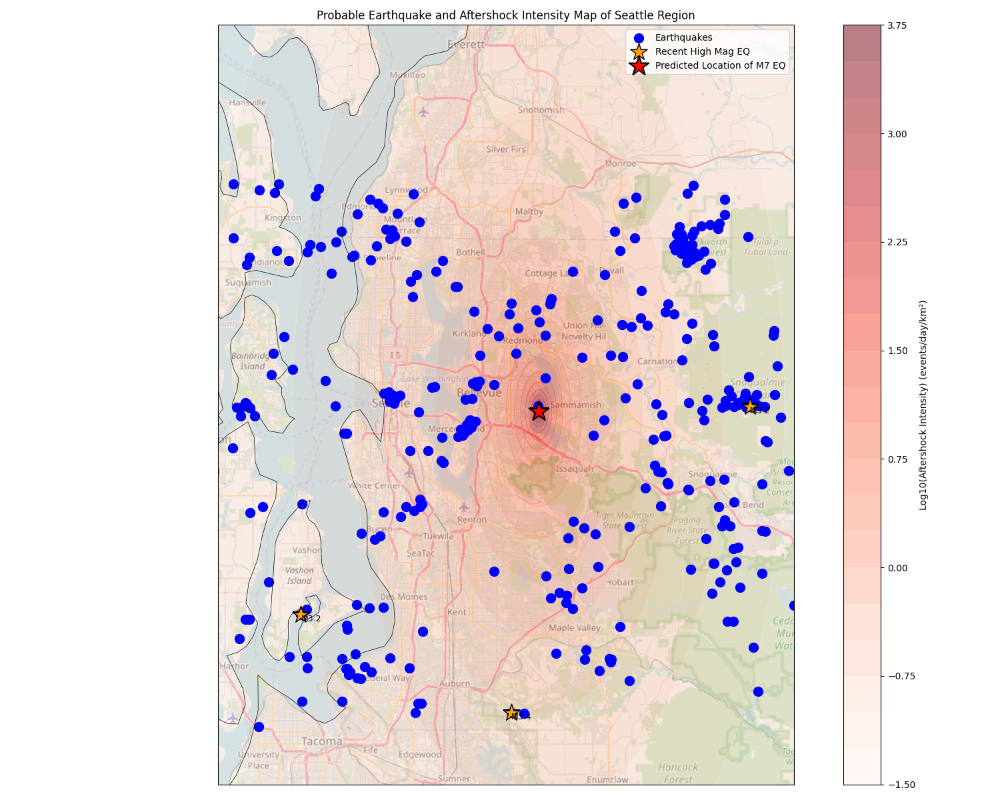

# Geospat: Seattle Earthquake Impact & Prediction


*Modified Mercalli Intensity (MMI) Map for a simulated M7.0 earthquake in the Seattle area.*

## Overview

**Geospat** is a geospatial data science project dedicated to earthquake prediction, aftershock simulation, and risk assessment for the Seattle region. It utilizes historical earthquake data, advanced statistical models (ETAS), and building vulnerability datasets to visualize and forecast the impact of major seismic events, with a particular emphasis on unreinforced masonry (URM) buildings. The predicted outcomes from this project were incorporated into the analysis section of the documentation portfolio for the Geospatial Technology Event in TSA.

## Features
- **Earthquake Aftershock Simulation:** Predicts aftershock locations and intensities using the ETAS model.
- **MMI Mapping:** Visualizes the Modified Mercalli Intensity (MMI) for a simulated M7.0 earthquake.
- **URM Building Risk:** Maps the locations of vulnerable unreinforced masonry buildings in Seattle.
- **Interactive Visualizations:** Generates high-quality maps overlaying earthquake data, predicted impacts, and building risks.

## Data Sources
- `data/query.csv`: Historical earthquake catalog for the Seattle region (1900–2025), including time, location, depth, and magnitude.
- `data/EQinSeattle.csv`: Subset of significant earthquakes within Seattle.
- `data/Unreinforced_Masonry_Buildings_(URM).csv`: Inventory of URM buildings in Seattle, with risk categories, addresses, and geolocations.

## Example Outputs

| MMI Map | ETAS Map | URM Map |
|---|---|---|
|  |  |  |

- **MMI Map:** Shows predicted shaking intensity for a simulated M7.0 earthquake.
- **ETAS Map:** Displays aftershock probability density based on the ETAS model.
- **URM Map:** Highlights locations of unreinforced masonry buildings at risk.

## How to Run

### 1. Install Dependencies

This project requires Python 3.8+ and the following packages:
- pandas
- numpy
- matplotlib
- cartopy
- scipy
- geopy

Install them with:
```bash
pip install pandas numpy matplotlib cartopy scipy geopy
```

### 2. Prepare Data
Ensure the `data/` directory contains the required CSV files:
- `query.csv`
- `EQinSeattle.csv`
- `Unreinforced_Masonry_Buildings_(URM).csv`

### 3. Generate Maps

#### a) Earthquake Aftershock & MMI Map
Runs ETAS simulation and MMI mapping for a scenario earthquake:
```bash
python scripts/etas_map.py
```
- Output: `outputs/mmi_map.png`, `outputs/etas_map.png`

#### b) Seattle URM Impact Map
Maps URM buildings and predicted epicenter:
```bash
python scripts/seattle_eq_impact.py
```
- Output: `outputs/urm_map.png`

## Project Structure
```
├── data/         # Input datasets (earthquakes, URM buildings)
├── outputs/      # Generated maps and visualizations
├── scripts/      # Main analysis and plotting scripts
├── README.md     # Project documentation
```

## Acknowledgments
- Earthquake data: USGS and local seismic networks
- URM data: City of Seattle open data
- Mapping: OpenStreetMap, Cartopy

---

*For questions or contributions, please open an issue or pull request.*